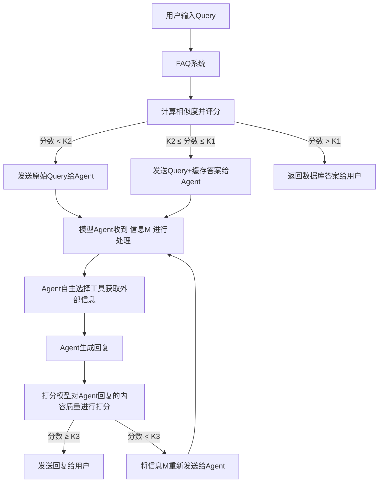

# RAG (Retrieval-Augmented Generation) 项目

基于LangChain框架和vLLM推理加速的RAG系统实现，支持多轮对话和工具调用。

## 项目特点

- 采用LangChain框架进行部署，使用vLLM框架进行模型推理加速
- 支持上下文多轮对话，利用LangChain的Memory机制
- 结合FAQ系统和模型Agent，实现高效问答
- 支持多种检索数据源：FAISS向量库、Elasticsearch、Arxiv和自定义MCP接口
- 使用智谱AI的大语言模型和嵌入模型
- 基于打分模型的回复质量控制机制

## 项目目录

rag_project/
├── main.py                     # 主入口文件
├── config.py                   # 配置文件
├── requirements.txt            # 项目依赖
├── modules/
│   ├── __init__.py
│   ├── faq_system.py           # FAQ系统模块
│   ├── model_agent.py          # 模型Agent模块
│   ├── scoring_model.py        # 打分模型
│   └── tools/
│       ├── __init__.py
│       ├── db_query.py         # 数据库查询工具(Elastic和FAISS)
│       ├── arxiv_query.py      # Arxiv查询工具
│       └── mcp_query.py        # MCP查询工具
├── utils/
│   ├── __init__.py
│   ├── cache.py                # 缓存机制
│   └── embeddings.py           # 嵌入模型工具
└── data/
    ├── csv/                    # 存放CSV文件
    └── pdf/                    # 存放PDF文件

## 系统架构

系统由以下主要模块组成：

1. **FAQ系统**
   - 以问答对形式存储的向量数据库（基于FAISS）
   - 将用户查询与数据库中的问题进行匹配
   - 根据相似度阈值决定处理策略

2. **模型Agent**
   - 使用智谱AI的API
   - 采用ReACT和CoT进行推理
   - 支持多种外部工具调用

3. **外部工具**
   - 数据库查询（Elastic和FAISS）
   - Arxiv学术论文检索
   - MCP外部信息获取

4. **打分模型**
   - 评估回复质量
   - 决定是否需要重新生成回复

## 处理流程

整个系统的处理流程如下：

1. 用户输入查询
2. FAQ系统计算相似度并评分：
   - 分数 < K1：直接发送原始Query给Agent
   - K1 ≤ 分数 ≤ K2：发送Query+缓存答案给Agent
   - 分数 > K2：直接返回数据库答案给用户

3. 模型Agent处理：
   - 接收查询信息
   - 自主选择工具获取外部信息
   - 生成回复

4. 打分模型评估：
   - 对Agent回复的内容质量进行打分
   - 分数 ≥ K3：发送回复给用户
   - 分数 < K3：重新发送给Agent处理



## 项目结构

```
rag_project/
├── main.py                     # 主入口文件
├── config.py                   # 配置文件
├── requirements.txt            # 项目依赖
├── modules/
│   ├── __init__.py
│   ├── faq_system.py           # FAQ系统模块
│   ├── model_agent.py          # 模型Agent模块
│   ├── scoring_model.py        # 打分模型
│   └── tools/
│       ├── __init__.py
│       ├── db_query.py         # 数据库查询工具(Elastic和FAISS)
│       ├── arxiv_query.py      # Arxiv查询工具
│       └── mcp_query.py        # MCP查询工具
├── utils/
│   ├── __init__.py
│   ├── cache.py                # 缓存机制
│   └── embeddings.py           # 嵌入模型工具
└── data/
    ├── csv/                    # 存放CSV文件
    └── pdf/                    # 存放PDF文件
```

## 安装与配置

1. 安装依赖：

```bash
pip install -r requirements.txt
```

2. 配置环境变量：

创建一个`.env`文件，包含以下内容：

```
ZHIPUAI_API_KEY=your_zhipuai_api_key
ELASTICSEARCH_URL=your_elasticsearch_url
MCP_API_URL=your_mcp_api_url
MCP_API_KEY=your_mcp_api_key
```

3. 准备数据：

- 将CSV文件放入`data/csv`目录
- 将PDF文件放入`data/pdf`目录
- 准备FAQ数据（JSON格式）

## 使用方法

### 交互模式

```bash
python main.py --mode interactive
```

### 命令行模式

```bash
python main.py --mode cli --query "你的问题"
```

### 加载FAQ数据

```bash
python main.py --faq path/to/faq.json
```

## FAQ格式

FAQ数据应为JSON格式，结构如下：

```json
[
  {
    "question": "问题1",
    "answer": "答案1"
  },
  {
    "question": "问题2",
    "answer": "答案2"
  }
]
```

## 系统配置

在`config.py`文件中可以调整以下关键参数：

- `FAQ_SIMILARITY_THRESHOLD_K1`：FAQ系统相似度下限阈值
- `FAQ_SIMILARITY_THRESHOLD_K2`：FAQ系统相似度上限阈值
- `SCORING_THRESHOLD_K3`：打分模型阈值
- `LLM_MODEL`：大语言模型名称
- `EMBEDDING_MODEL`：嵌入模型名称

## 开发与扩展

### 添加新工具

1. 在`modules/tools/`目录下创建新的工具模块
2. 在`model_agent.py`中的`_initialize_tools`方法中添加工具定义
3. 在`execute_tool`方法中实现工具调用逻辑

### 自定义FAQ系统

1. 修改`faq_system.py`中的相关代码
2. 调整相似度计算和匹配逻辑

### 调整打分模型

1. 修改`scoring_model.py`中的评估标准
2. 调整打分阈值和重新生成策略